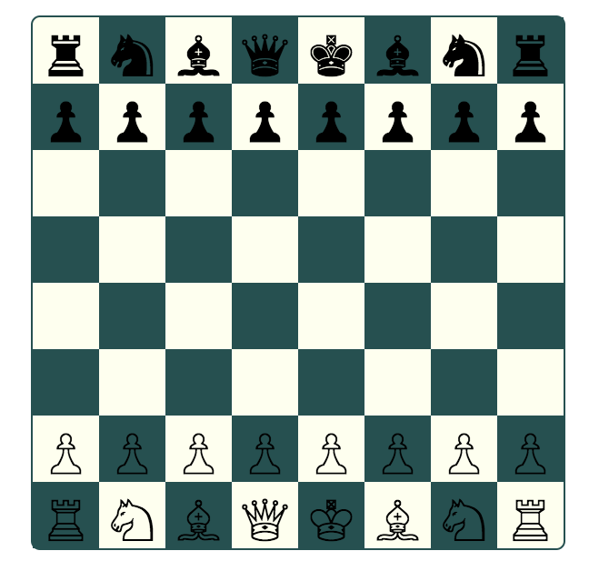
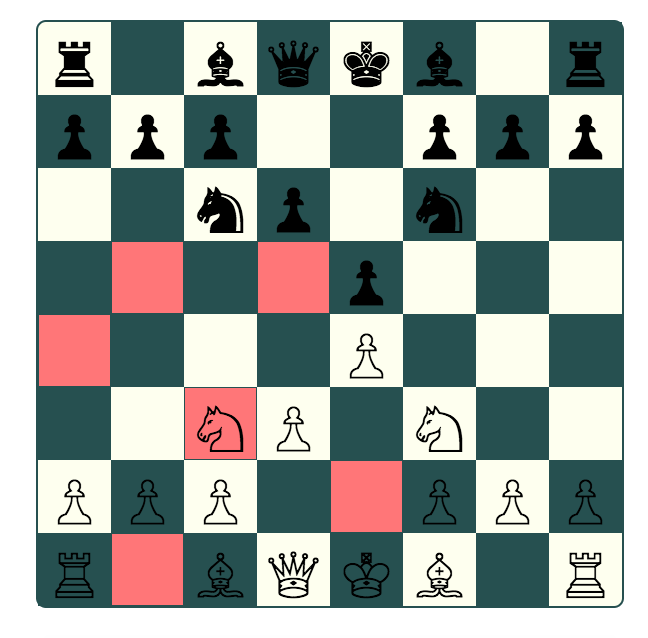
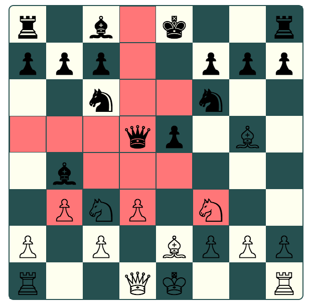

# Objective

Build a simple chess game using ES6 class syntax. Implement turns. Only allow pieces to move to empty spaces or capture enemy pieces. Do not allow the king to move into check.

During a turn, when a user clicks on one of their pieces, the spaces they can move to are highlighted. Clicking on a highlighted space moves the piece and ends the turn.

### Initial Gameboard
<!--  -->


### Knight Move Options
<!--  -->


### Queen Move Options
<!--  -->


# Technologies Used
* HTML
* CSS
* JavaScript (ES6)

# Code Examples

All game pieces inherit properties from the Piece class, shown below:

```
import BoardState from '../board/boardState';

export default class Piece {
	constructor(color, row, col, img) {
		this.color = color;
		this.row = row;
		this.col = col;
		this.img = String.fromCharCode(parseInt(img, 16));
	}

	move(row, col) { // input is the row and column of square where piece will move
		BoardState.state[row][col] = BoardState.state[this.row][this.col];
		BoardState.state[this.row][this.col] = null;
		this.row = row;
		this.col = col;
	}
}
```

Below, the Knight inherits from Piece and adds unique functionality:

```
import Piece from './piece';
import BoardState from '../board/boardState';


export default class Knight extends Piece {
	constructor(color, row, col) {
		const img = color === 'white' ? '2658' : '265E';
		super(color, row, col, img);
	}

	getTargets(forCheck) {
		const arr = [];
		const possibleTargets = [
			`${+this.row - 2}${+this.col - 1}`,
			`${+this.row - 2}${+this.col + 1}`,
			`${+this.row - 1}${+this.col - 2}`,
			`${+this.row - 1}${+this.col + 2}`,
			`${+this.row + 1}${+this.col - 2}`,
			`${+this.row + 1}${+this.col + 2}`,
			`${+this.row + 2}${+this.col - 1}`,
			`${+this.row + 2}${+this.col + 1}`
		];
		for (let i = 0; i < possibleTargets.length; i++) {
			if (possibleTargets[i].length < 3) {
				const newRow = possibleTargets[i][0];
				const newCol = possibleTargets[i][1];
				if (BoardState.describeSquare(newRow, newCol) === 'empty') {
					arr.push(possibleTargets[i]);
				} else if (BoardState.describeSquare(newRow, newCol) === 'enemy') {
					arr.push(possibleTargets[i]);
				} else if (BoardState.describeSquare(newRow, newCol) === 'ally') {
					if (forCheck) {
						arr.push(possibleTargets[i]);
					} else {
						continue;
					}
				}
			}
		}
		return arr;
	}
}
```
# Future Ideas

Implement castling and en passant. Handle a win or loss.

